# Inspire PC

Inspire PC is a site for keen computer enthusiasts to upload pictures and specs of their machines.  Or for newbies looking for inspiration to start on their first PC. 

## Live Site
[Inspire PC](https://inspire-pc.herokuapp.com/)

## Contents
- [User Experiences](#user-experience)
  - [User Stories](#user-stories)
  - [Agile Methodology](#agile-methodology)
  - [Wireframes](#wireframes)
  - [Database](#database)
  - [Color Scheme](#color-scheme)
- [Features](#features)
  - [Existing Features](#existing-features)
  - [Future Features](#future-features)
- [Technologies](#technologies)
  - [Languages & Frameworks](#languages-and-frameworks)
  - [Other](#other)
- [Testing](#testing)
- [Deployment](#deployment)
  - [Database](#database)
  - [Heroku](#heroku)
  - [Cloudinary](#cloudinary)
  - [Forking](#forking)
  - [Cloning](#cloning)
- [Credits](#credits)

## **User Experiences**
### **User Stories**

As a user I should be able to:
  - View all posts
  - Filter to specify results
  - Register or Log into an account
  - Create a post
  - Update or Delete my own posts

[Back to top](#contents)

### **Agile Methodology**

This project was made using some agile methodologies, but a more traditional method.  I used pen and paper to write out my to do list and any other issues which might have cropped up during the development process.  Unfortunately this wasn't documented on a site like the GitHub project board or Jira etc so is not possible to bring onto here.  I have put into the same original to do task into the [project board](https://github.com/users/camerong-dev/projects/4) as an indication of what I had on paper. 

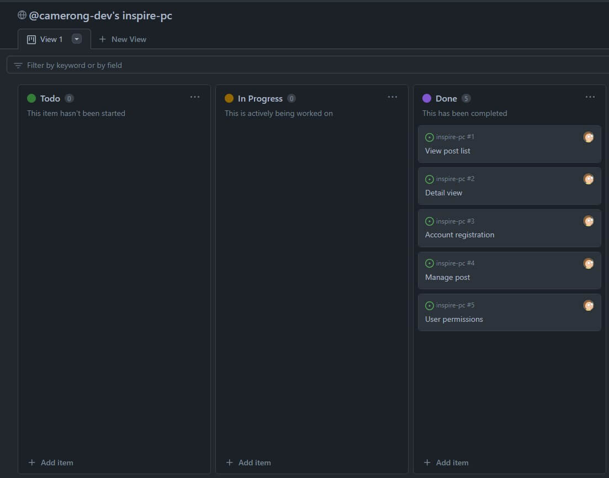

[Back to top](#contents)

### **Wireframes**

Wireframes were created using Balsamiq.  These were initial ideas of the site structure and layout. 

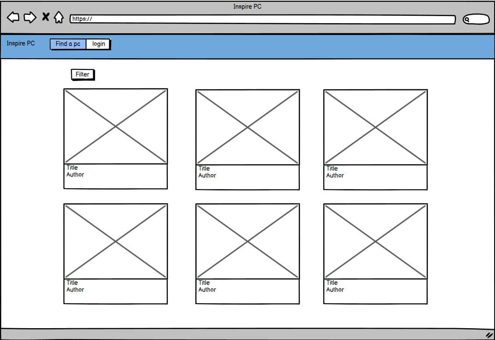
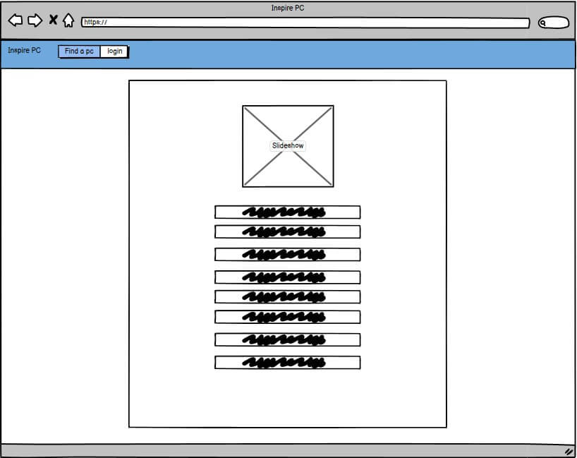
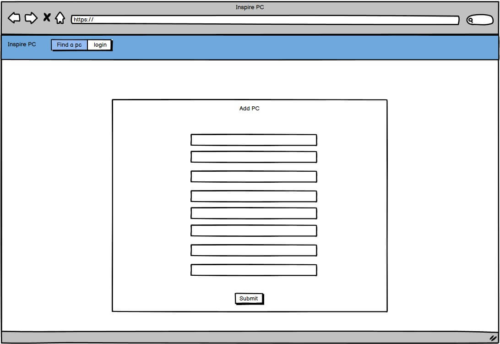
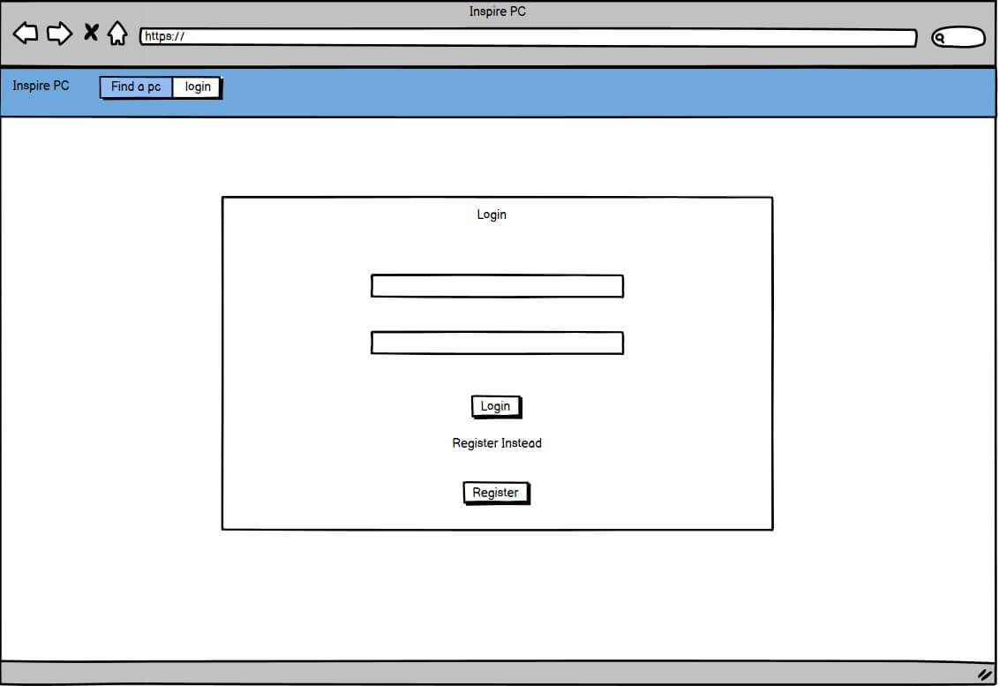
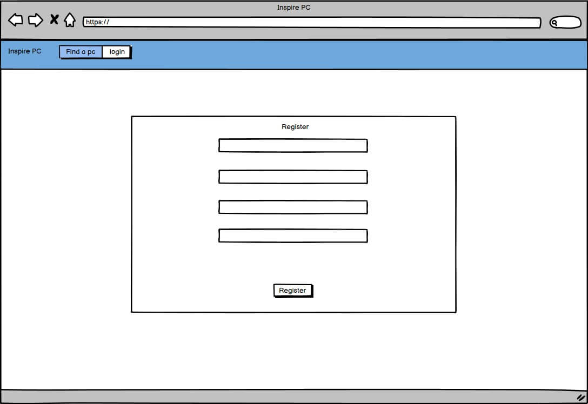

[Back to top](#contents)

### **Database**

I used [Lucid chart](https://lucidchart.com/pages/) to create a data flow diagram showing what an authorized and non-authorized user had access to throughout the site. I have also shown below my custom model and the user model which was used within this project.

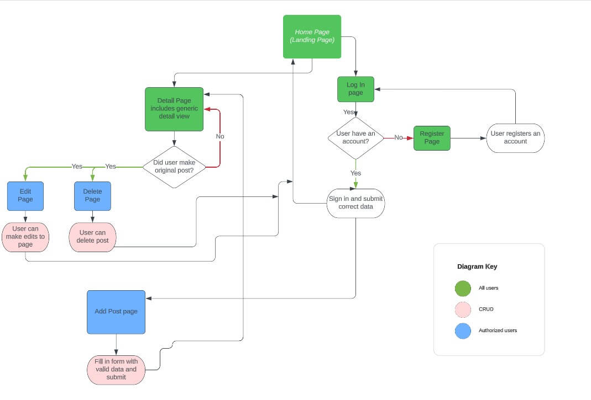

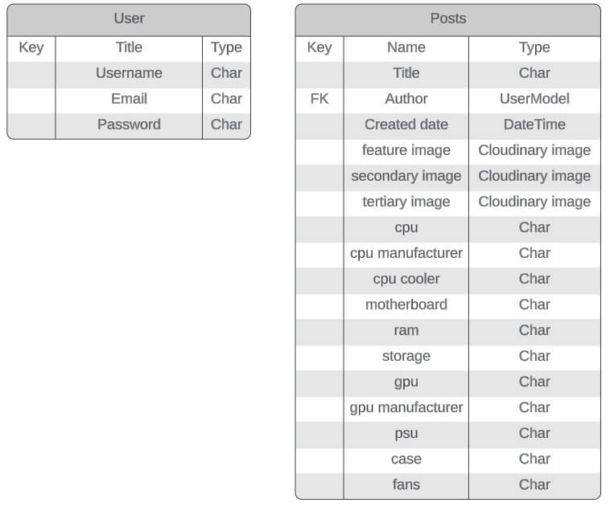

[Back to top](#contents)

### **Color Scheme**

All colors used throughout are listed below.  I found the blue color on [colormind](https://www.colormind.io) and liked the vibrancy it provided.  I then used a basic light grey and white background to go with the blue, to leave me with a clean and modern looking site.  I prefer to use fewer colors as there is less chance of clashing and a lot of the time too much colour can confuse the end user.

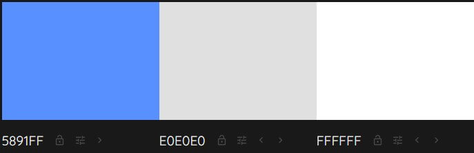

[Back to top](#contents)

## **Features**
### **Existing Features**
### Navbar

  - The navigation bar is featured on all pages of the site.
  - InspirePC link will take you to the home page.
  - Find a pc link will take you to the home page.
  - If user is logged in add pc link will take them to the add pc form page.
  - If logged in the user will have a log out option.
  - If user is not logged in there will be a log in option instead.
  - Fully responsive thanks to bootstrap, it becomes collapsable for mobile and tablet use.

[Back to top](#contents)

### Filter Dropdown

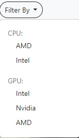

  - The filter dropdown is located at top of page, on the left side of container.
  - Changes color when hovered.
  - Clicking on it reveals different options for a user to filter by.
  - If user filters by an option, this dissappears and changes to a reset filter button.

[Back to top](#contents)

### Home Card

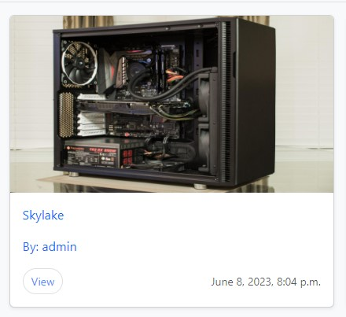

  - This is how all posts will be displayed on the home page.
  - Feature image is displayed here for all users to see.
  - Title and author is shown on left side of screen.
  - Date of post being created is in bottom right.
  - View button changes color when hovered.

[Back to top](#contents)

### Pagination

  - Displays at bottom of container on home screen.
  - Current page is indicated by blue border around number.
  - 1 page either side of current page is availble to select.
  - First and last page always show.
  - Hovering changes color of button.

[Back to top](#contents)

### Social Footer

  - Social icons displayed in footer.
  - Each icon is linked to the given media platform.
  - My GitHub profile is also displayed here.

[Back to top](#contents)

### Add PC Form

  - User can input data relating to their machine here.
  - All fields must contain data.
  - CPU and GPU manufacturer are dropdowns containing pre-defined options.

[Back to top](#contents)

### PC Detail View

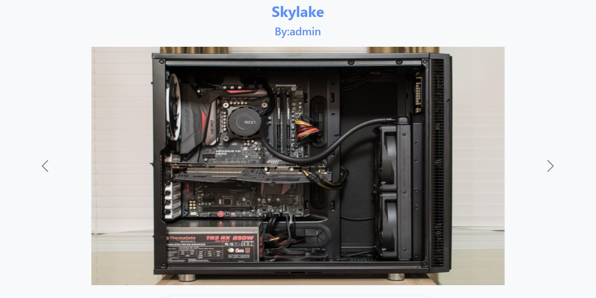
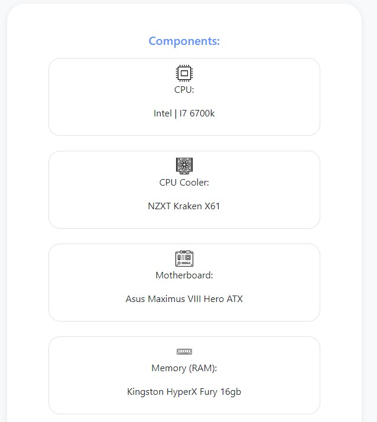
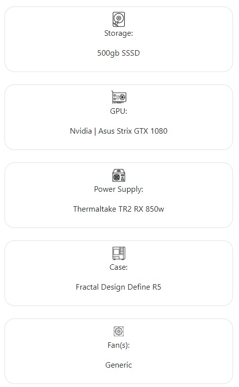
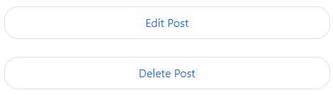

  - User is first shown an automatic slideshow of the 3 uploaded images.
  - Components are posted below the slideshow.
  - Handy icons are featured on each list item thanks to [icons8](https://www.icons8.com). 
  - If user is logged in and viewing post they made, edit and delete buttons are available at the bottom.

[Back to top](#contents)

### Edit PC 

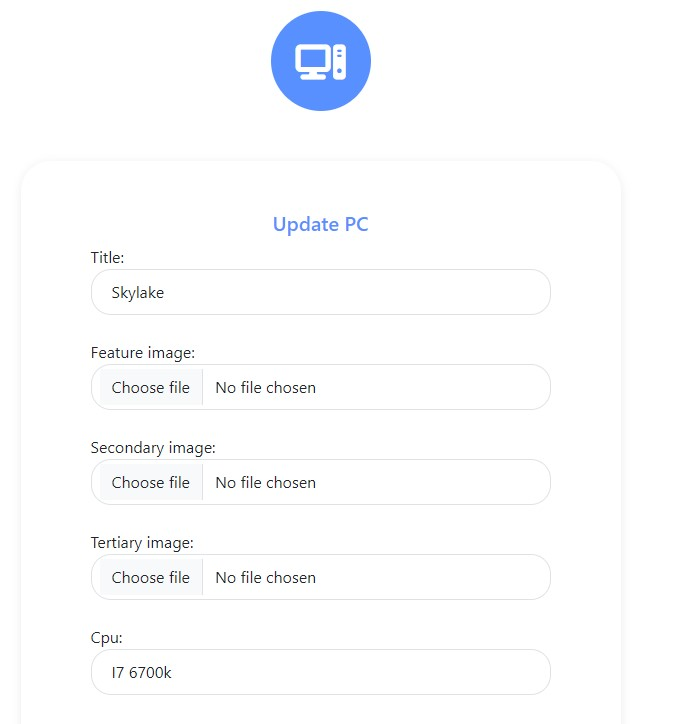

  - User will see existing data which they uploaded when initially creating the PC.
  - Data can be replaced with what the user desires.
  - Page cannot be accessed by anyone other than the original poster (apart from admin via admin page).

[Back to top](#contents)

### Delete PC

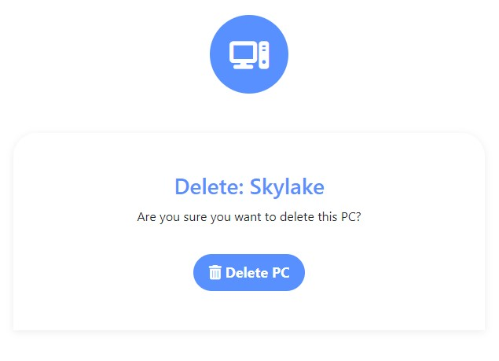

  - User will be shown the title of PC they are going to delete.
  - Page cannot be accessed by anyone other than the original poster (apart from admin via admin page).

[Back to top](#contents)

### Login Page

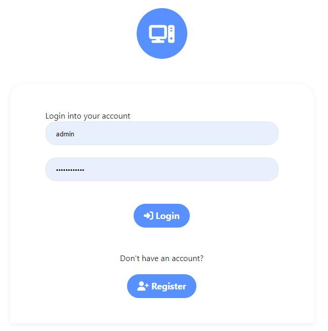

  - User will be shown a simple form requesting them to input a username and password.
  - Validation is present to check if fields are blank.
  - If user doesn't have account they have the option to create one.

[Back to top](#contents)

### Register Page

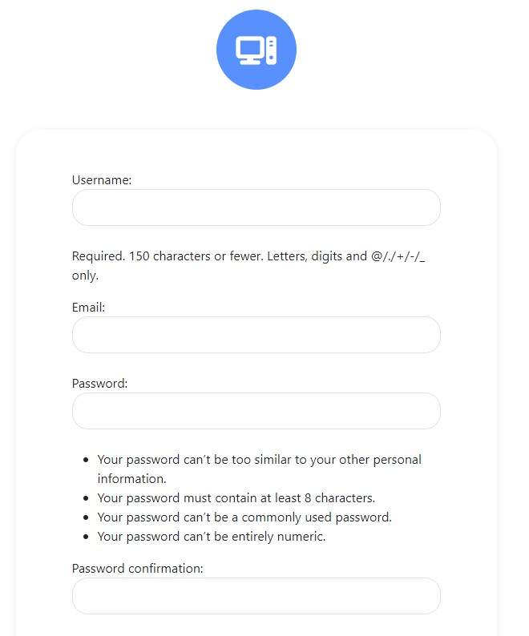

  - User requested to enter a username, email and password.

[Back to top](#contents)

### Future Features

  - Incorporate a like or upvote system
  - Allow users to add comments to posts
  - Add a search function on the home page
  - Add a sort by function on the home page
  - Add more fields to the database for users to input then to be filterd by
  - Email authentication:
    - Confirmation email with a code to enter
    - Allows password resets
  - Video support for posts

[Back to top](#contents)

## **Technologies**
### **Languages and Frameworks**
  - [Python](https://www.python.org/)
  - [Django](https://www.djangoproject.com/)
  - [Bootstrap](https://getbootstrap.com/)
  - [HTML5](https://en.wikipedia.org/wiki/HTML5)
  - [CSS3](https://en.wikipedia.org/wiki/CSS)

### **Other**
  - [ElephantSQL](https://www.elephantsql.com/) was used as the postgres, database system
  - [Font Awesome](https://fontawesome.com/) was used to provide icons throughout the app
  - [Heroku](https://www.heroku.com/home?) was used to host my deployed project
  - [TinyPNG](https://tinypng.com/) was used to decrease size of uploaded files
  - [Balsamiq](https://balsamiq.com/) was used to create wireframes
  - [Auto PEP8](https://pypi.org/project/autopep8/) was used at the end to try and tidy up some of my python files

[Back to top](#contents)

## **Testing**

The app was tested during and after development. Results can be found [here](https://github.com/camerong-dev/inspire-pc/blob/main/TESTING.md)

[Back to top](#contents)

## **Deployment**
### **Database**
To create a managed postgres database go to [ElephantSQL](https://www.elephantsql.com/) and Sign Up / Login.
  - Click on 'Create new instance'

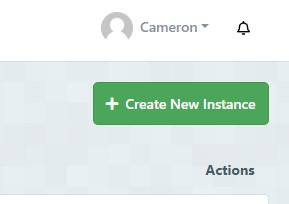

  - Name your database, choose the 'Tiny Turtle' plan and click 'Select Region'

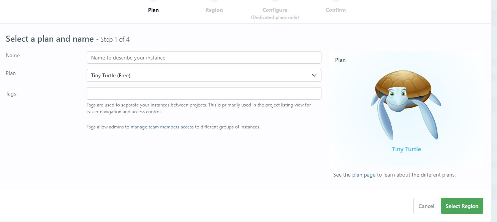

  - Choose your region and then create the database. instance.
  - In the instances page, click the name of your chosen database.
  - In the details section of the following page copy the postgres url.

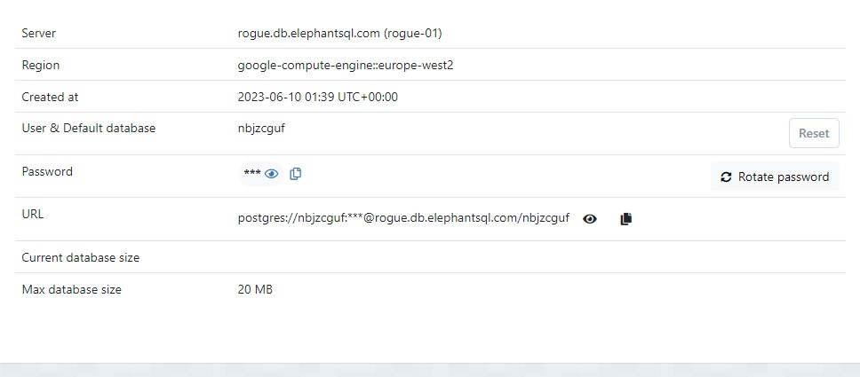

You can now use this URL when linking the database to the project repository.

[Back to top](#contents)

### **Heroku**

  - Sign Up / Login to Heroku
  - Create a new app from the Heroku dashboard

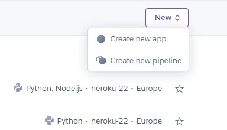

  - Give the app a unique name and enter the region of operation then click 'create app'.
  - From your newly created app choose the settings tab and navigate to 'Reveal Config Vars'.
  - Paste the ElephantSQL Database url into the DATABASE_URL environment variable.

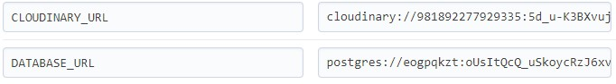

  - Create an env.py file in the root directory of your Django project (at the same directory level as requirements.txt and manage.py). Once created add the filename to .gitignore as it stores sensitive info.

  - Paste the ElephantSQL url for the DATABASE_URL value.
  - Add the following libraries to the settings.py file: Import Path from pathlib, dj_database_url and os.

  - Create a secret key to replace the insecure SECRET_KEY variable in the settings.py file. Link the secure key in env.py to the settings.py SECRET_KEY variable with the following code: SECRET_KEY =         os.environ.get('SECRET_KEY')
  - Add your secret key to HEROKU Config Vars.
  - Link the DATABASES value to the env.py file with the following code: DATABASES = { 'default': dj_database_url.parse(os.environ.get('DATABASE_URL')) }
  - You can now migrate the app models to the new database using the command: "python3 manage.py makemigrations" then Python3 manage.py migrate.

[Back to top](#contents)

## **Cloudinary**

  - Signup/Signin to Cloudinary
  - Copy the 'cloudinary url' from your account dashboard and paste it as the CLOUDINARY_URL value in env.py.
  - Add the CLOUDINARY_URL to the Config Vars in Heroku.
  - Also Add the DISABLE_COLLECTSTATIC Key with the value of 1
  - Change the static file settings in Django by altering the following.
  - The STATIC_URL
  - STATICFILES_STORAGE
  - STATICFILES_DIRS
  - STATIC_ROOT
  - MEDIA URL
  - DEFAULT_FILE_STORAGE

The STATIC section of settings.py should resemble the following image:

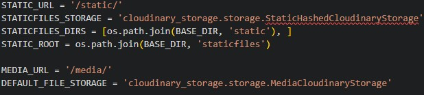

  - Change the TEMPLATES 'DIRS' Setting in Settings.py to [TEMPLATES_DIR] TEMPLATES configuration for the project should resemble the following image:

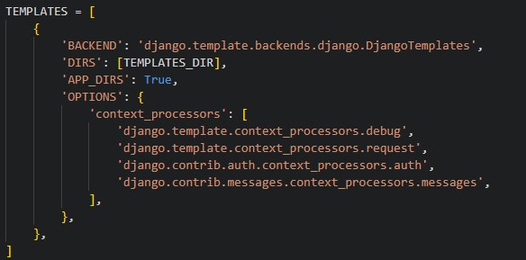

  - Back nearer the top of the settings.py file add the Setting TEMPLATES_DIR = os.path.join(BASE_DIR, 'templates')
  - Create 3 new folders for static files, media files and HTML templates. (At the same directory level as requirements.txt and manage.py.)
  - Create a Procfile(capital P) and add the following: web: gunicorn NAME_OF_THE_APP_GOES_HERE.wsgi
  - Add the app name and herokuapp.com to the list of ALLOWED_HOSTS.
  - Add and commit the changes to GitHub.
  - Remove DISABLE_COLLECTSTATIC from Heroku Config Vars
  - Deploy via the 'Deploy Main Branch' button in the Deployment page of HEROKU.
  - If you receive an success message, you can click the link provided to view the app in the web browser.

[Back to top](#contents)

## **Forking**

  - Sign up / Login to GitHub
  - Follow this link to my repo - https://github.com/camerong-dev/inspire-pc
  - Click on the 'Fork' button near top-right of the screen.
  - A copy of my repository should now be availble in your list of GitHub repos

[Back to top](#contents)

## **Cloning**

  - Sign Up / Login to GitHub
  - Follow this link to the MyPSE.ie repository: https://github.com/camerong-dev/inspire-pc
  - Click on the <> Code button near the top-right of the page.
  - Access the 'Code' menu from above the main directory window and choose a preferred cloning option by selecting either HTTPS or GitHub CLI. An SSH key is required should you prefer that option.
  - Press the overlapping squares icon to copy the link to the repository.
  - Open the code editor of your choice.
  - Create a new working directory for the cloned repo.
  - Use the 'git clone command and paste in the copied link.
  - Press enter and the repo will be cloned locally to your machine.
  - Setup and activate your local development environment.
  - Install the project requirements using the command -- pip3 install -r requirements.txt
  - Create a Heroku app for your Clone and add the appropriate Config Vars using the instructions above.
  - Create an env.py file that includes the appropriate DATABSE_URL, SECRET_KEY and CLOUDINARY_URL settings.
  - Add 'localhost' to ALLOWED_HOSTS in settings.py
  - Use the command -- python3 manage.py makemigrations followed by -- python3 manage.py migrate to setup a local copy of the project database.
  - Use the command python3 manage.py runserver to run the app on a development server.

[Back to top](#contents)

## **Credits**

### UI 

  - Navbar is a slightly modified version of bootstrap's fixed nav bar, which can be found [here](https://getbootstrap.com/docs/5.3/examples/navbar-fixed/)
  - The home page uses bootstrap's album example, which can be found [here](https://getbootstrap.com/docs/5.3/examples/album/)
  - [Font Awesome](https://fontawesome.com/) for the icons used throughout
  - [Icons 8](https://icons8.com/) for the images used on the detail page

### Code

  - The formatChecker.py was taken from [here](https://stackoverflow.com/questions/2472422/django-file-upload-size-limit)
  - To get the user model setup I used this [video](https://www.youtube.com/watch?v=mpfHDSmqHds&list=PLCC34OHNcOtr025c1kHSPrnP18YPB-NFi&index=10) as a reference
  - Used this [video](https://www.youtube.com/watch?v=PTsljbR-Cmo&list=PLCC34OHNcOtr025c1kHSPrnP18YPB-NFi&index=13) to help me make my filter view
  - Used this [video](https://www.youtube.com/watch?v=2MkULPXXXLk&list=PLCC34OHNcOtr025c1kHSPrnP18YPB-NFi&index=15) to help make the filter dropdown on home page
  - Used this [documentation](https://docs.djangoproject.com/en/4.2/ref/class-based-views/generic-editing/) for my Edit and Delete functionality
  - Used this [documentation](https://docs.djangoproject.com/en/4.2/topics/pagination/) for my pagination implementation
  - Used this [documentation](https://developer.mozilla.org/en-US/docs/Learn/Server-side/Django/Testing) for my automated tests

### Other Sources

  - [Django Documentation](https://docs.djangoproject.com/en/4.2/)
  - [Django Guide](https://www.w3schools.com/django/index.php)
  - [Bootstrap Documentation](https://getbootstrap.com/docs/5.3/getting-started/introduction/)
  - [Django Web Framework](https://developer.mozilla.org/en-US/docs/Learn/Server-side/Django)

