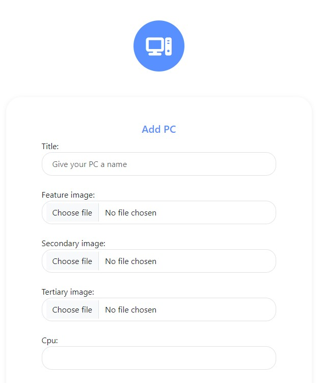

# Inspire PC

Inspire PC is a site for keen computer enthusiasts to upload pictures and specs of their machines.  Or for newbies looking for inspiration to start on their first PC. 

## Live Site
[Inspire PC](https://inspire-pc.herokuapp.com/)

## Contents
- [User Experiences](#user-experience)
  - [User Stories](#user-stories)
  - [Agile Methodology](#agile-methodology)
  - [Wireframes](#wireframes)
  - [Database](#database)
  - [Color Scheme](#color-scheme)
- [Features](#features)
  - [Existing Features](#existing-features)
  - [Future Features](#future-features)
- [Technologies](#technologies)
  - [Languages & Frameworks](#languages-and-frameworks)
  - [Other](#other)
- [Testing](#testing)

## **User Experiences**
### **User Stories**

As a user I should be able to:
  - View all posts
  - Filter to specify results
  - Register or Log into an account
  - Create a post
  - Update or Delete my own posts

[Back to top](#contents)

### **Agile Methodology**

This project was made using some agile methodologies, but a more traditional method.  I used pen and paper to write out my to do list and any other issues which might have cropped up during the development process.  Unfortunately this wasn't documented on a site like the GitHub project board or Jira etc so is not possible to bring onto here.  I have put into the same original to do task into the [project board](https://github.com/users/camerong-dev/projects/4) as an indication of what I had on paper. 

[Back to top](#contents)

### **Wireframes**

Wireframes were created using Balsamiq.  These were initial ideas of the site structure and layout. 

[Back to top](#contents)

### **Database**

I used [Lucid chart](https://lucidchart.com/pages/) to create a data flow diagram showing what an authorized and non-authorized user had access to throughout the site. I have also shown below my custom model and the user model which was used within this project.

[Back to top](#contents)

### **Color Scheme**

All colors used throughout are listed below.  I found the blue color on [colormind](https://www.colormind.io) and liked the vibrancy it provided.  I then used a basic light grey and white background to go with the blue, to leave me with a clean and modern looking site.  I prefer to use fewer colors as there is less chance of clashing and a lot of the time too much colour can confuse the end user.

[Back to top](#contents)

## **Features**
### **Existing Features**
### Navbar

  - The navigation bar is featured on all pages of the site.
  - InspirePC link will take you to the home page.
  - Find a pc link will take you to the home page.
  - If user is logged in add pc link will take them to the add pc form page.
  - If logged in the user will have a log out option.
  - If user is not logged in there will be a log in option instead.
  - Fully responsive thanks to bootstrap, it becomes collapsable for mobile and tablet use.

[Back to top](#contents)

### Filter Dropdown

  - The filter dropdown is located at top of page, on the left side of container.
  - Changes color when hovered.
  - Clicking on it reveals different options for a user to filter by.
  - If user filters by an option, this dissappears and changes to a reset filter button.

[Back to top](#contents)

### Home Card

  - This is how all posts will be displayed on the home page.
  - Feature image is displayed here for all users to see.
  - Title and author is shown on left side of screen.
  - Date of post being created is in bottom right.
  - View button changes color when hovered.

[Back to top](#contents)

### Pagination

  - Displays at bottom of container on home screen.
  - Current page is indicated by blue border around number.
  - 1 page either side of current page is availble to select.
  - First and last page always show.
  - Hovering changes color of button.

[Back to top](#contents)

### Social Footer

  - Social icons displayed in footer.
  - Each icon is linked to the given media platform.
  - My GitHub profile is also displayed here.

[Back to top](#contents)

### Add PC Form

  - User can input data relating to their machine here.
  - All fields must contain data.
  - CPU and GPU manufacturer are dropdowns containing pre-defined options.

[Back to top](#contents)

### PC Detail View

  - User is first shown an automatic slideshow of the 3 uploaded images.
  - Components are posted below the slideshow.
  - Handy icons are featured on each list item thanks to [icons8](https://www.icons8.com). 
  - If user is logged in and viewing post they made, edit and delete buttons are available at the bottom.

[Back to top](#contents)

### Edit PC 

  - User will see existing data which they uploaded when initially creating the PC.
  - Data can be replaced with what the user desires.
  - Page cannot be accessed by anyone other than the original poster (apart from admin via admin page).

[Back to top](#contents)

### Delete PC

  - User will be shown the title of PC they are going to delete.
  - Page cannot be accessed by anyone other than the original poster (apart from admin via admin page).

[Back to top](#contents)

### Login Page

  - User will be shown a simple form requesting them to input a username and password.
  - Validation is present to check if fields are blank.
  - If user doesn't have account they have the option to create one.

[Back to top](#contents)

### Register Page

  - User requested to enter a username, email and password.

[Back to top](#contents)

### Future Features

  - Incorporate a like or upvote system
  - Allow users to add comments to posts
  - Add a search function on the home page
  - Add a sort by function on the home page
  - Add more fields to the database for users to input then to be filterd by
  - Email authentication:
    - Confirmation email with a code to enter
    - Allows password resets
  - Video support for posts

[Back to top](#contents)

## **Technologies**
### **Languages and Frameworks**
  - [Python](https://www.python.org/)
  - [Django](https://www.djangoproject.com/)
  - [Bootstrap](https://getbootstrap.com/)
  - [HTML5](https://en.wikipedia.org/wiki/HTML5)
  - [CSS3](https://en.wikipedia.org/wiki/CSS)

### **Other**
  - [ElephantSQL](https://www.elephantsql.com/) was used as the postgres, database system
  - [Font Awesome](https://fontawesome.com/) was used to provide icons throughout the app
  - [Heroku](https://www.heroku.com/home?) was used to host my deployed project
  - [TinyPNG](https://tinypng.com/) was used to decrease size of uploaded files
  - [Balsamiq](https://balsamiq.com/) was used to create wireframes
  - [Auto PEP8](https://pypi.org/project/autopep8/) was used at the end to try and tidy up some of my python files

## **Testing**

The app was tested during and after development. Results can be found [here](https://github.com/camerong-dev/inspire-pc/blob/main/TESTING.md)

