## Automated Testing

I had made some automated tests for the registration form.  This includes valid and invalid data, GET and POST requests too.  Running this multiple times returns no errors.

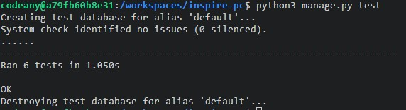

No further automated testing was completed.

## Manual Testing

### Nav Bar
  - Ability to select 'Find A PC' nav link - PASS
  - Ability to select 'Inspire PC' nav link - PASS
  - If user not logged in, display 'Log In' nav link - PASS
  - Abilty to select 'Log In' nav link - PASS
  - If user logged in, display username in top right - PASS
  - If user logged in, display 'Log Out; nav link - PASS
  - Ability to select 'Log Out' nav link - PASS

### Social Footer
  - Ability to select social icons - PASS
  - Ability to select my GitHub link - PASS

### Home Page
  - Ability to select and choose an item from the filter dropdown - PASS
  - Ability to change page using the pagination buttons - PASS
  - Ability to view a post

### PC Detail Page
  - Slideshow works without interaction - PASS
  - Ability to interact with the slideshow - PASS
  - All data is populated in the given fields - PASS
  - If user is logged in and made post, show edit and delete button - PASS
  - If user is not logged in, don't show edit and delete button - PASS
  - If user is logged in but didn't make post, don't show edit and delete button - PASS

### Log In Page
  - If correct details are entered, user is logged in - PASS
  - If incorrect details are entered, don't allow user access - PASS
  - Login button functions correctly - PASS
  - Register button takes user to register page - PASS

### Register Page
  - User cannot create account with already existing username - PASS
  - User must input data into all fields - PASS
  - Refuse email input if it does not contain @ - PASS
  - Refuse password input if does not meet requirements - PASS
  - Refuse username input if does not meet requirements - PASS
  - If all valid data is entered, allow user to register account - PASS
  - Once registered, redirect to login page - PASS

### Add PC Page
  - If non logged in user gets to this page, display error message with login redirect button - PASS
  - If valid data is entered, allow form to be posted - PASS
  - If invalid data is entered, don't allow form to be posted - PASS
  - Only upload images that are JPEG or PNG - PASS
  - All fields are mandatory - PASS

### Edit Page
  - If user is logged in and made post allow access - PASS
  - If valid data is entered, allow form to be posted - PASS
  - If invalid data is entered, don't allow form to be posted - PASS
  - Only upload images that are JPEG or PNG - PASS
  - All fields are mandatory - PASS

### Delete Page
  - If user is logged in and made post allow access - PASS
  - Delete button function works and redirects to home page - PASS

## Validation 

### HTML Validation
### Home Page 
  - No errors apart from some styling elements. This appears to be related to font awesome and nothing related to my created code.

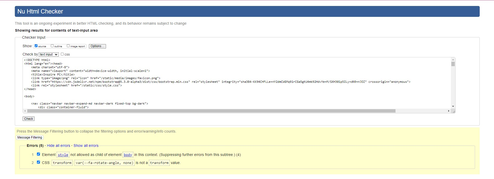

### Detail Page
  - No errors apart from some styling elements. This appears to be related to font awesome and nothing related to my created code.

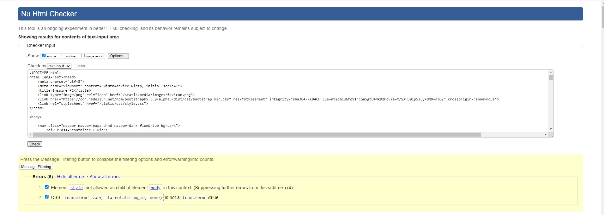

### Login Page
  - No errors apart from some styling elements. This appears to be related to font awesome and nothing related to my created code.

### Register Page
  - No errors apart from some styling elements. This appears to be related to font awesome and nothing related to my created code.

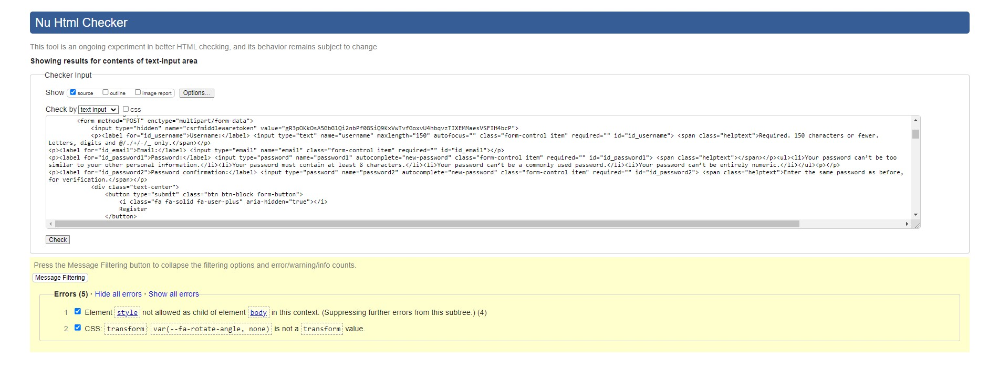

### Add PC Page
  - I have one new error relating to the attribute 'maxlength'.  This error states I cannot use this attribute due to the form being a select field.  Removing this from the models.py throws an error as well.
    I've decided to leave this in here as nothing functionality wise is affected, nor do any other errors appear in console when running the app.

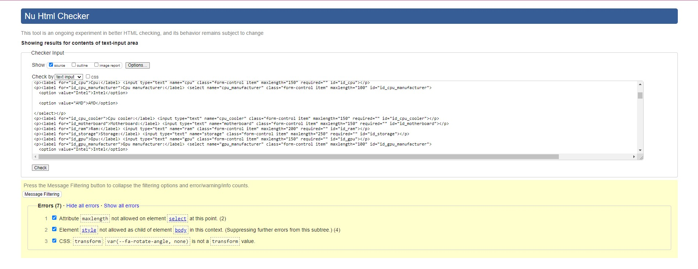

### Update PC Page
  - I have one new error relating to the attribute 'maxlength'.  This error states I cannot use this attribute due to the form being a select field.  Removing this from the models.py throws an error as well.
    I've decided to leave this in here as nothing functionality wise is affected, nor do any other errors appear in console when running the app.

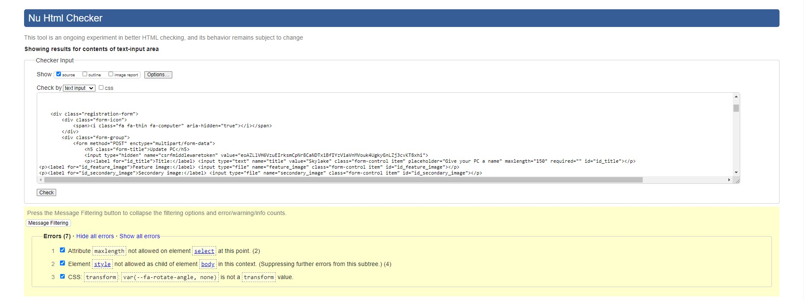

### Delete PC Page
  - No errors apart from some styling elements. This appears to be related to font awesome and nothing related to my created code.

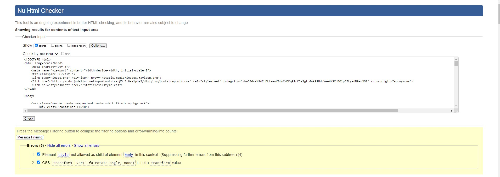

### CSS Validation

Running my style.css file through the validator returned no errors.
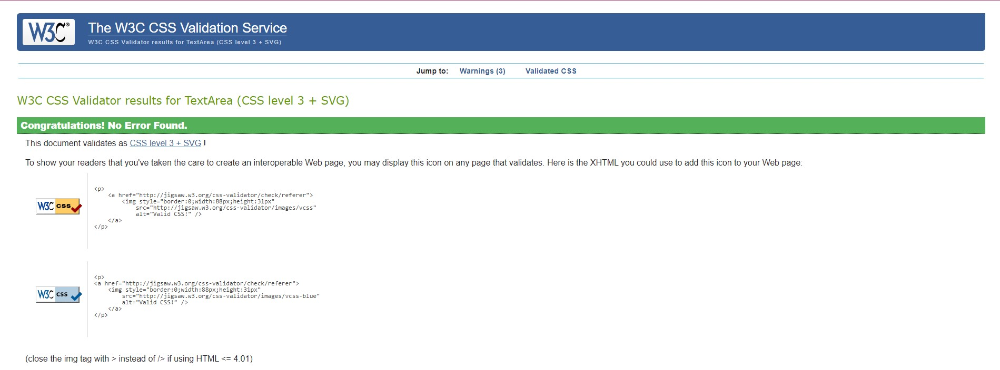

### Python Validation
To note I have not put all python files through a validator due to the fact some have one or two lines, or haven't been touched.  The files below were the most worked on files.

### formatChecker.py
  - No errors apart from line too long.

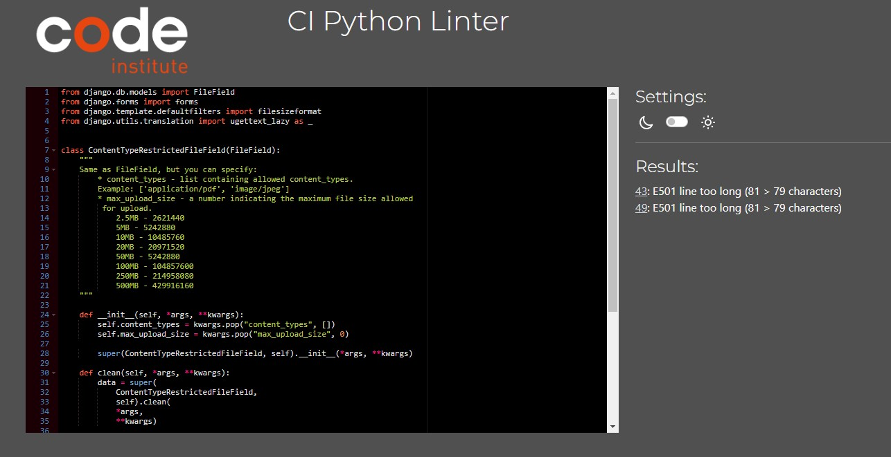

### forms.py within inspiration
  - All clear

### models.py within inspiration
  - All clear

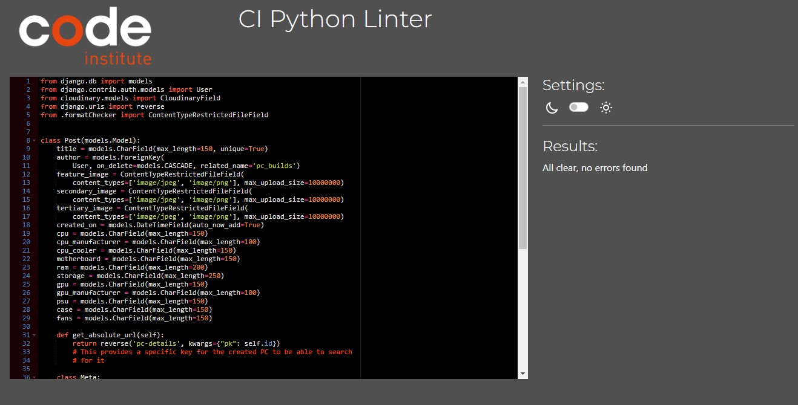

### urls.py within inspiration
  - All clear

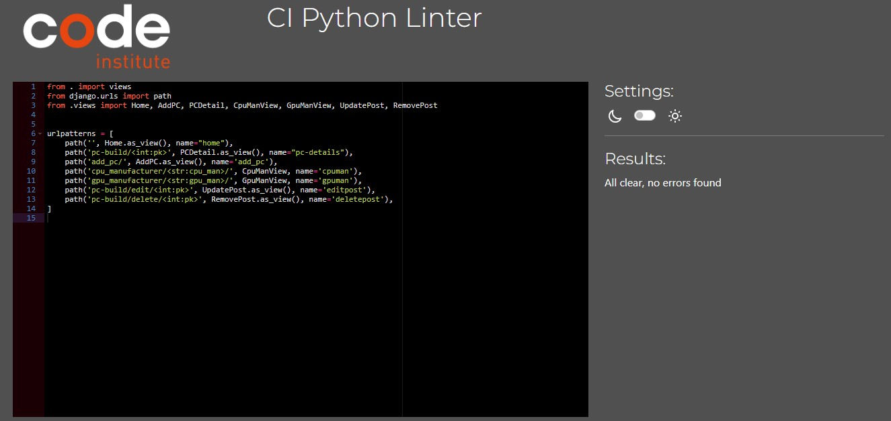

### views.py within inspiration
  - No errors apart from line too long. 

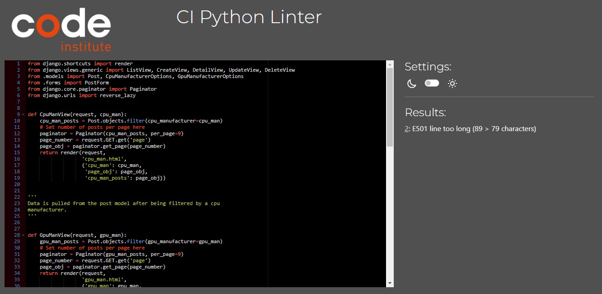

### settings.py
  - No errors apart from line too long.

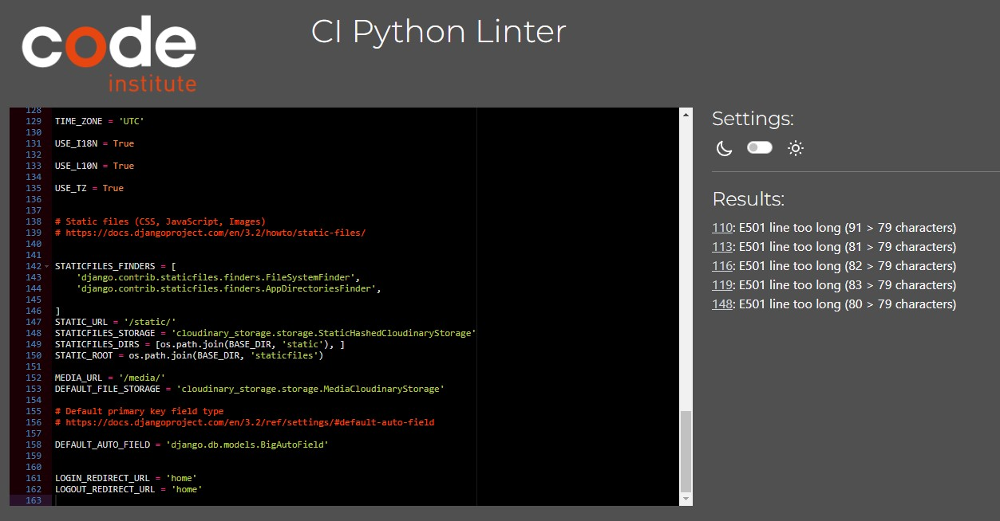

### forms.py within signeduser
  - All clear

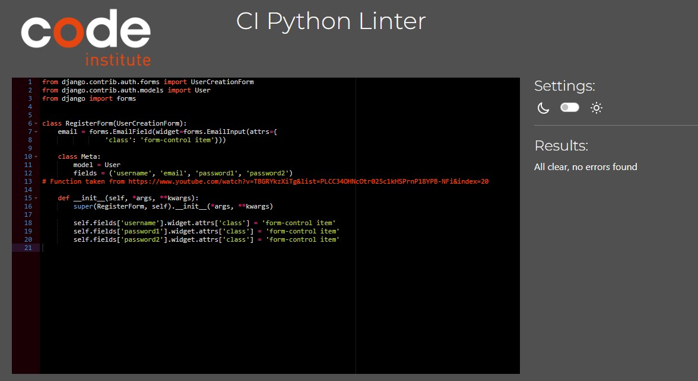

## Device Testing

Using Google Developer Tools, I mimicked mobile phones in the browser to test for scaling and to ensure all data was displayed clearly.   During my testing everything behaved as intended and all images were
very clear, all containers scaled down to fit corectly.  All functionality was still working with no issues.

Return to main [README](https://github.com/camerong-dev/inspire-pc#testing)
 
